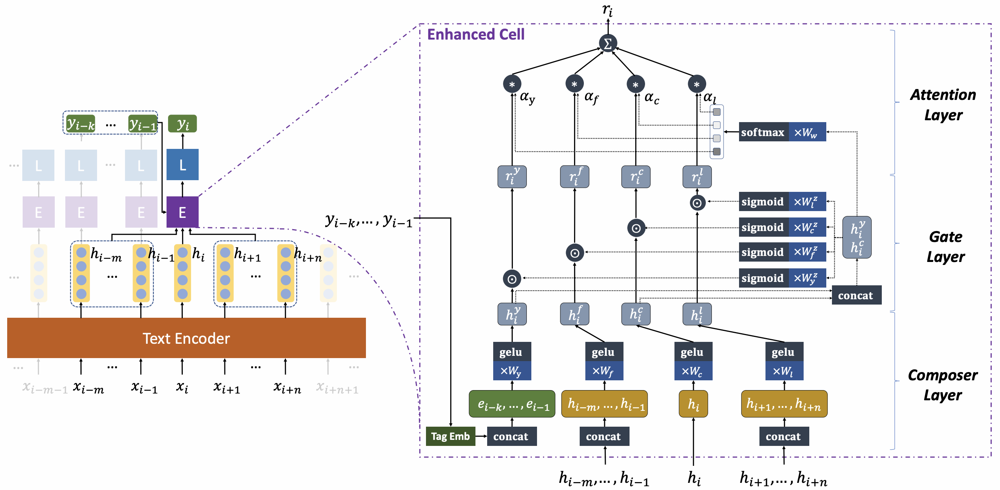

CofeNet
==============================================
This is the source code of COLING 2022 paper "CofeNet: Context and Former-Label Enhanced Net for Complicated Quotation Extraction". See our [paper](https://aclanthology.org/2022.coling-1.215/) for more details.

**Abstract**: Quotation extraction aims to extract quotations from written text. There are three components in a quotation: _source_ refers to the holder of the quotation, _cue_ is the trigger word(s), and _content_ is the main body. Existing solutions for quotation extraction mainly utilize rulebased approaches and sequence labeling models. While rule-based approaches often lead to low recalls, sequence labeling models cannot well handle quotations with complicated structures. In this paper, we propose the **Co**ntext and **F**ormer-Label **E**nhanced **Net** (CofeNet) for quotation extraction. CofeNet is able to extract complicated quotations with components of variable lengths and complicated structures. On two public datasets (_i.e._, PolNeAR and Riqua) and one proprietary dataset (_i.e._, PoliticsZH), we show that our CofeNet achieves state-of-the-art performance on complicated quotation extraction.
<p align="center"></p>

# 1. Setup
## Environment
```
# Python version==3.7
git clone https://github.com/cofe-ai/CofeNet.git
cd CofeNet
pip install -r requirements.txt
```

## Datasets

The data set is in the `./res` directory. Here we give two datasets `polnear` and `riqua` in our [paper](https://aclanthology.org/2022.coling-1.215/). You can store other datasets here for the framework to read.

```
./res
├── polnear
│   ├── tag.txt
│   ├── test.txt
│   ├── train.txt
│   ├── valid.txt
│   └── voc.txt
├── riqua
│   ├── tag.txt
│   ├── test.txt
│   ├── train.txt
│   ├── valid.txt
│   └── voc.txt
├── others
└── ...
```

If you want to use other datasets, you need to build 5 files for each dataset. The file names do not change:
* `train.txt`, `test.txt`, `valid.txt`: Structured Dataset.

Each item of data is stored in a line by json. The label "tokens" is the text words sequence, and "labels" is the corresponding sequence label tag.
```json
{"tokens": ["WikiLeaks", "claims", "`", "state", ...], "labels": ["B-source", "B-cue", "B-content", "I-content", ...]}
```

* `tag.txt`: The set of "labels" in the dataset.
* `voc.txt`: Tokens vocabulary for non-pretrained model(_i.e._, LSTM).

## Experiment Configure

Configuration files are stored in the `conf/setting` directory. Here we give the experimental configuration's name(`exp_name`) in the [paper](https://aclanthology.org/2022.coling-1.215/) so that you can quickly reproduce the experimental results. You can also configure your experiments here.

| Base Model | Dateset | Base             |    with CRF          | with Cofe        | Dateset | Base             |    with CRF          | with Cofe        |
|:-----------|:-------:|------------------|:--------------------:|------------------|:-------:|------------------|:--------------------:|------------------|
| Embedding  | polnear | `pn_emb`         |  `pn_emb_crf`        | `pn_emb_cofe`    | riqua   | `rq_emb`         |  `rq_emb_crf`        | `rq_emb_cofe`    |
| CNN        | polnear | `pn_cnn`         |  `pn_cnn_crf`        | `pn_cnn_cofe`    | riqua   | `rq_cnn`         |  `rq_cnn_crf`        | `rq_cnn_cofe`    |
| GRU        | polnear | `pn_gru`         |  `pn_gru_crf`        | `pn_gru_cofe`    | riqua   | `rq_gru`         |  `rq_gru_crf`        | `rq_gru_cofe`    |
| LSTM       | polnear | `pn_lstm`        |  `pn_lstm_crf`       | `pn_lstm_cofe`   | riqua   | `rq_lstm`        |  `rq_lstm_crf`       | `rq_lstm_cofe`   |
| BiLSTM     | polnear | `pn_blstm`       |  `pn_blstm_crf`      | `pn_blstm_cofe`  | riqua   | `rq_blstm`       |  `rq_blstm_crf`      | `rq_blstm_cofe`  |
| BiLSTM L2  | polnear | `pn_blstm2`      |  `pn_blstm2_crf`     | `pn_blstm2_cofe` | riqua   | `rq_blstm2`      |  `rq_blstm2_crf`     | `rq_blstm2_cofe` |
| BERT       | polnear | `pn_bert`        |  `pn_bert_crf`       | `pn_bert_cofe`   | riqua   | `rq_bert`        |  `rq_bert_crf`       | `rq_bert_cofe`   |
| BERT-CNN   | polnear | `pn_bert_cnn`    |                      |                  | riqua   | `rq_bert_cnn`    |                      |                  |
| BERT-LSTM  | polnear | `pn_bert_lstm`   |                      |                  | riqua   | `rq_bert_lstm`   |                      |                  |
| BERT-BiLSTM| polnear | `pn_bert_blstm`  |  `pn_bert_blstm_crf` |                  | riqua   | `rq_bert_blstm`  |  `rq_bert_blstm_crf` |                  |

## Trained model

Download the [trained model](https://drive.google.com/drive/folders/1sU7m3e9lZABq_bLsDWjoeUV3QPX01Glc?usp=sharing). Save in `./conf/models`. Reproduce our results by [Evaluate](#Evaluate).

# 2. Run

## Train

1. Run the code

```bash
# Cofe for polnear
python run_train.py --exp_name pn_emb_cofe --trn_name v1 --eval_per_step 250 --max_epoch 15 --batch_size 32 --gpu 0
python run_train.py --exp_name pn_cnn_cofe --trn_name v1 --eval_per_step 250 --max_epoch 15 --batch_size 32 --gpu 0
python run_train.py --exp_name pn_gru_cofe --trn_name v1 --eval_per_step 250 --max_epoch 15 --batch_size 32 --gpu 0
python run_train.py --exp_name pn_lstm_cofe --trn_name v1 --eval_per_step 250 --max_epoch 15 --batch_size 32 --gpu 0
python run_train.py --exp_name pn_blstm_cofe --trn_name v1 --eval_per_step 250 --max_epoch 15 --batch_size 32 --gpu 0
python run_train.py --exp_name pn_blstm2_cofe --trn_name v1 --eval_per_step 250 --max_epoch 15 --batch_size 32 --gpu 0
python run_train.py --exp_name pn_bert_cofe --trn_name v1 --eval_per_step 500 --max_epoch 6 --batch_size 15 --bert_learning_rate 5e-5 --gpu 0

# Cofe for riqua
python run_train.py --exp_name rq_emb_cofe --trn_name v1 --eval_per_step 10 --max_epoch 20 --batch_size 32 --gpu 0
python run_train.py --exp_name rq_cnn_cofe --trn_name v1 --eval_per_step 10 --max_epoch 20 --batch_size 32 --gpu 0
python run_train.py --exp_name rq_gru_cofe --trn_name v1 --eval_per_step 10 --max_epoch 20 --batch_size 32 --gpu 0
python run_train.py --exp_name rq_lstm_cofe --trn_name v1 --eval_per_step 10 --max_epoch 20 --batch_size 32 --gpu 0
python run_train.py --exp_name rq_blstm_cofe --trn_name v1 --eval_per_step 10 --max_epoch 20 --batch_size 32 --gpu 0
python run_train.py --exp_name rq_blstm2_cofe --trn_name v1 --eval_per_step 10 --max_epoch 20 --batch_size 32 --gpu 0
python run_train.py --exp_name rq_bert_cofe --trn_name v1 --eval_per_step 10 --max_epoch 20 --batch_size 15 --bert_learning_rate 5e-5 --gpu 0

```

2. Check log

You can find log files in `./log`. For a set of experiments, here you can find the files:
* Parameter Configuration (_i.e._, `pn_bert_cofe_v1_20221101_040732.json`)
* Training Log (_i.e._, `pn_bert_cofe_v1_20221101_040732.txt`)
* Tensorboard Files (_i.e._, `pn_bert_cofe_v1_20221101_040732/`)

3. Run Tensorboard

```bash
tensorboard --bind_all --port 9900 --logdir ./log
```

## Evaluate

Run the code to print the experimental results of the trained model.

```bash
# Cofe for polnear
python run_eval.py --exp_name pn_emb_cofe --gpu 0
python run_eval.py --exp_name pn_cnn_cofe --gpu 0
python run_eval.py --exp_name pn_gru_cofe --gpu 0
python run_eval.py --exp_name pn_lstm_cofe --gpu 0
python run_eval.py --exp_name pn_blstm_cofe --gpu 0
python run_eval.py --exp_name pn_blstm2_cofe --gpu 0
python run_eval.py --exp_name pn_bert_cofe --gpu 0

# Cofe for riqua
python run_eval.py --exp_name rq_emb_cofe --gpu 0
python run_eval.py --exp_name rq_cnn_cofe --gpu 0
python run_eval.py --exp_name rq_gru_cofe --gpu 0
python run_eval.py --exp_name rq_lstm_cofe --gpu 0
python run_eval.py --exp_name rq_blstm_cofe --gpu 0
python run_eval.py --exp_name rq_blstm2_cofe --gpu 0
python run_eval.py --exp_name rq_bert_cofe --gpu 0
```

# 3. Experiment

CofeNet Detail Experiment [here](./docs/cofenet-detail-exp.pdf)

# 4. Cite

If the code help you, please cite the following paper.

```
@inproceedings{wang-etal-2022-cofenet,
    title = "{C}ofe{N}et: Context and Former-Label Enhanced Net for Complicated Quotation Extraction",
    author = "Wang, Yequan  and
      Li, Xiang  and
      Sun, Aixin  and
      Meng, Xuying  and
      Liao, Huaming  and
      Guo, Jiafeng",
    booktitle = "Proceedings of the 29th International Conference on Computational Linguistics",
    month = oct,
    year = "2022",
    address = "Gyeongju, Republic of Korea",
    publisher = "International Committee on Computational Linguistics",
    url = "https://aclanthology.org/2022.coling-1.215",
    pages = "2438--2449",
    abstract = "Quotation extraction aims to extract quotations from written text. There are three components in a quotation: \textit{source} refers to the holder of the quotation, \textit{cue} is the trigger word(s), and \textit{content} is the main body. Existing solutions for quotation extraction mainly utilize rule-based approaches and sequence labeling models. While rule-based approaches often lead to low recalls, sequence labeling models cannot well handle quotations with complicated structures. In this paper, we propose the \textbf{Co}ntext and \textbf{F}ormer-Label \textbf{E}nhanced \textbf{Net} () for quotation extraction. is able to extract complicated quotations with components of variable lengths and complicated structures. On two public datasets (and ) and one proprietary dataset (), we show that our achieves state-of-the-art performance on complicated quotation extraction.",
}
```
